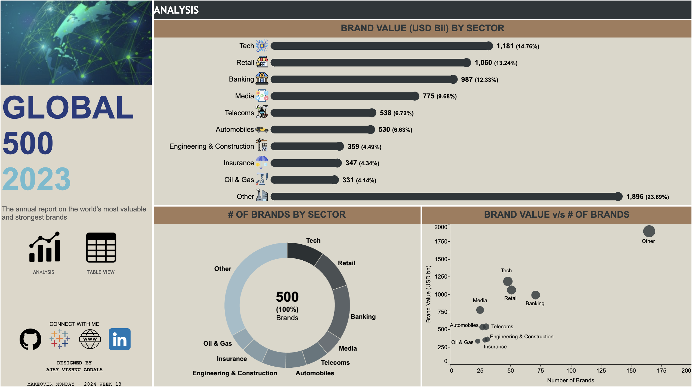

# Global 500 Brands Analysis Dashboard

This repository contains the Tableau dashboard for the Global 500 brands, showcasing an annual report of the world's most valuable and strongest brands.

## Tableau Dashboard

### Overview

The dashboard provides a detailed analysis of brand value breakdown by sector, the number of brands by sector, and the scatter plot relationship between brand value and the number of brands in each sector within the top 500 brands.

### Features

- Interactive and dynamic visualization: Viewers can hover over the dashboard to see visuals dynamically changing and revealing more insights.
- Table view: For viewers who prefer a tabular representation of the data, there's a toggle option to switch between the dashboard view and the table view.
- Key insights: The dashboard highlights key insights derived from the data analysis.

## Tableau Public Link

Explore the interactive dashboard on Tableau Public: [Global 500 Brands Analysis Dashboard](https://public.tableau.com/views/Global500Brands2023MOM2024Week18/Global500_Analysis?:language=en-US&:sid=&:display_count=n&:origin=viz_share_link)

## Dataset

The dataset used for this analysis includes the following fields:

- Sector
- Brand Value (USD bn)
- Percentage of total brand value
- Number of brands
- Percentage of total brands

## Repository Contents

- Tableau packaged workbook file containing the interactive dashboard.
- Dataset used for the analysis.
- This file provides an overview of the project.

## How to Use

1. Clone or download the repository to your local machine.
2. Open Tableau File in Tableau Desktop to interact with the dashboard.
3. Explore the dashboard to gain insights into the Global 500 brands.
4. Toggle between the dashboard view and the table view to explore the data further.

